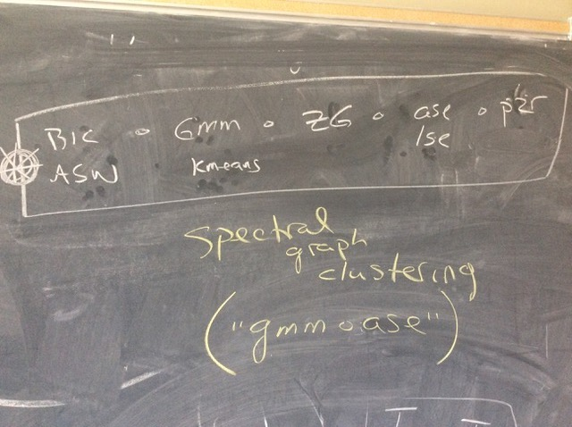

```{r setup, include=FALSE, results='asis'}

source("~/Dropbox/Worm/Codes/Connectome/mbstructure/R/structure-utils.R")
#source("http://www.cis.jhu.edu/~parky/Semipar_vs_Nonpar/utils.r")
source("~/Dropbox/RFiles/ccc_utils.R")

suppressMessages(library(knitr))
suppressMessages(library(rgl))
#opts_knit$set(animation.fun = hook_scianimator)
#knit_hooks$set(webgl = hook_webgl)


#suppressMessages(library(tourr))
#suppressMessages(library(animint))
suppressMessages(library(RColorBrewer))

pitch_tour <- function(dat, color_by = "pitch_type", vars = c("start_speed", "break_y", "break_angle", "break_length"),
                       nprojs = 200, out_dir = tempdir()) {
  kept <- dat[names(dat) %in% vars]
  kept[] <- lapply(kept, as.numeric)
  idx <- complete.cases(kept)
  kept <- kept[idx, ]
  type <- dat[idx, color_by, drop = TRUE]
  mat <- rescale(as.matrix(kept))
  tour <- new_tour(mat, grand_tour(), NULL)
  steps <- c(0, rep(1/15, nprojs))
  stepz <- cumsum(steps)
  tour_dat <- function(step_size) {
    step <- tour(step_size)
    proj <- center(mat %*% step$proj)
    df <- data.frame(x = proj[,1], y = proj[,2], type)
    list(dat = df, proj = data.frame(step$proj, vars = vars))
  }
  dats <- lapply(steps, tour_dat)
  datz <- Map(function(x, y) cbind(x$dat, step = y), dats, stepz)
  dat <- do.call("rbind", datz)
  projz <- Map(function(x, y) cbind(x$proj, step = y), dats, stepz)
  projs <- do.call("rbind", projz)
  projs$X1 <- round(projs$X1, 3)
  projs$X2 <- round(projs$X2, 3)
  dat$type <- factor(dat$type)
  p <- ggplot() + 
    geom_point(data = dat,
               aes(x = x, y = y, colour = type, showSelected = step)) +
    geom_segment(data = projs, alpha = 0.25,
                 aes(x = 0, y = 0, xend = X1, yend = X2, showSelected = step)) +
    geom_text(data = projs, alpha = 0.25,
              aes(x = X1, y = X2, label = vars, showSelected = step))
  plist <- list(
    plot = p,
    time = list(variable = "step", ms = 300),
    duration = list(step = 300)
  )
#  animint2dir(plist, out.dir = out_dir, open.browser = TRUE)
  structure(plist, class="animint")
}


```

Given a (possibly directed) (possibly weighted) graph $G=(V,E)$, the `gmmase` package does

1. do a _pass-to-rank_ for a weighted graph (`PTR`, no-op for an unweighted graph),
2. do a _graph spectral embedding_ (`ASE` or `LSE`^[D.L. Sussman, M. Tang, D.E. Fishkind, and C.E. Priebe, A consistent adjacency spectral embedding for stochastic blockmodel graphs, Journal of the American Statistical Association, Vol. 107, No. 499, pp. 1119-1128, 2012.]) with a _diagonal augmentation_,
3. do a _dimension reduction_ (`ZG`^[M. Zhu, and A. Ghodsi, Automatic dimensionality selection from the scree plot via the use of profile likelihood. Computational Statistics and Data Analysis, Vol. 51, 918–930, 2006.]) and merge left and right vectors (no-op for an undirected graph),
4. cluster vertices (`GMM`^[MCLUST Version 4 for R: Normal Mixture Modeling for Model-Based Clustering, Classification, and Density Estimation, Technical Report no. 597, Department of Statistics, University of Washington, June 2012.] or `Kmeans`).

<figure>

</figure>

```{r plotjpg, echo=FALSE, eval=FALSE, fig.width=8, fig.height=5}
plot_jpeg("~/Dropbox/D3M/D3M/gmmase.jpeg")
```

# Connectome Data

This vignette demo uses a connectome data^[K. Eichler, F. Li, A. L. Kumar, Y. Park, I. Andrade, C. Schneider-Mizell, T. Saumweber, A. Huser, D. Bonnery, B. Gerber, R. D. Fetter, J. W. Truman, C. E. Priebe, L. F. Abbott, A. Thum, M. Zlatic, and A. Cardona, "The complete connectome of a learning and memory center in an insect brain," Nature, no. 548, pp. 175-182, 2017.] with 123 vertices and 2740 edges.

```{r data, fig.show='hold', fig.width=7, fig.height=7, comment="#"}
library(gmmase)
suppressPackageStartupMessages(library(igraph))

data("akira")
summary(akira)
knitr::kable(as.matrix(akira[])[1:10,1:10], digits=2)

# take induced subgraph using only CN neurons
cn <- grep("CN", V(akira)$name)
g.cn <- induced_subgraph(akira, cn)
```

## `gmmase`

```{r gmm, fig.show='hold', fig.width=7, fig.height=7, comment="#"}
out <- gmmase(g.cn, dmax = 20, embed = "ASE", clustering = "GMM", verbose=FALSE)
```

Now, we are plotting a paired scatter plot colored by the clustering labels.

```{r post, fig.width=7, fig.height=7, comment="#"}
g <- out$g
mc <- out$mc
Xhat <- mc$data
dhat <- ncol(Xhat)/2
Khat <- mc$G
colnames(Xhat) <- paste0(rep(c("out","in"),each=2), 1:2)
class <- mc$classification
df <- data.frame(Xhat, cluster=factor(class))

library(ggplot2)
library(GGally)
ggpairs(df, columns=1:ncol(Xhat), mapping=aes(color=cluster, alpha=0.5))
```

## co-clustering

The data provider informed us from their beahvioral experiments that following neurons should be clustered onto their own groups.

- `CN4`, `CN12` `CN18`, and `CN41`,
- `CN19`,
- `CN40`.

```{r plotg, fig.width=7, fig.height=7, comment="#"}
v1 <- c(4,12,18,41)
v2 <- 40
v3 <- 19
vcc<- c(v1,v2,v3)
df2 <- data.frame(name=V(g)$name, cluster=class)
df2[vcc,]

V(g)$color <- "orange"
V(g)$color[v1] <- "magenta"
V(g)$color[v2] <- "cyan"
V(g)$color[v3] <- "green"

plot(g, mark.groups=lapply(1:Khat, function(x) which(class==x)),
     edge.arrow.size=0.5, vertex.label=NA, #vertex.label.cex=0.8, 
     vertex.size=7)#, vertex.color=rainbow(3, alpha=.5)[class])
```

This shows that we obtain the desired clustering!

# MNIST Data^[http://yann.lecun.com/exdb/mnist/]

There are 42000 training images of 10 digits (from 0 to 9), and we randomly select 1000 of them for our inference task. 

```{r mnist}
data(smnist)
slab <- smnist$slab
strain <- smnist$strain
(tab <- table(slab))
numTrain <- length(slab)

# Create a 28*28 matrix with pixel color values
res <- sqrt(ncol(strain))
glist <- lapply(1:numTrain, function(x) matrix(unlist(strain[x,]),byrow=T,ncol=res))
```

The following shows five random slections of each digit from the sampled data.

```{r plotg3, echo=FALSE, fig.show='hold', fig.width=7, fig.height=5, comment="#"}
# Plot a bunch of images
rotate <- function(x) t(apply(x, 2, rev)) # reverses (rotates the matrix)
opar <- par(no.readonly = T)
par(mfrow=c(5,10),mar=c(.01,.01,.01,.01))
for (i in 1:5) {
    tmp <- lapply(0:9,
            function(x) {
                ind <- sample(which(slab==x),1)
                image(rotate(glist[[ind]]),col=grey.colors(255),axes=F)
            })
}
par(opar)
```

And, followings are averaged images of each digit from the sampled data.

```{r plotmean, echo=FALSE, eval=TRUE, fig.width=8, fig.height=2, comment="#"}
gmean <- lapply(1:length(tab), function(x) Reduce("+", glist[slab==(x-1)])/tab[x])
opar <- par(no.readonly = T)
par(mfrow=c(1,10),mar=c(.01,.01,.01,.01))
tmp <- lapply(0:9,
            function(x) {
                image(rotate(gmean[[x+1]]),col=grey.colors(255),axes=F)
            })
par(opar)
```

```{r sim, echo=FALSE, eval=TRUE}
suppressMessages(library(mclust))

image.sim.MT <- function(img1,img2,sigma=0.5)
{
    sim <- exp(-sum((img1-img2)^2)/sigma^2)
    return(sim)
}

image.sim <- function(dat, sigma)
{
    n <- nrow(dat) # num image
    S <- matrix(0, n, n)
    for(i in 1:(n-1)) {
        for (j in (i+1)) {
            imgi <- as.numeric(dat[i,])
            imgj <- as.numeric(dat[j,])
            S[i,j] <- exp(-sum((imgi-imgj)^2)/(2*sigma^2))
            S[j,i] <- S[i,j]
        }
    }
    diag(S) <- 1
    return(S)
}

calcCorr <- function(mat,useCorr=FALSE,recalc=FALSE)
{
    if (useCorr) { ## lag=0 of ccf!
        if (recalc) {
            source("~/Dropbox/RFiles/fastcorr.r")
            ccfmat <- fastcorr(mat) # fast only on Revolution R!!
            diag(ccfmat) <- 0
        } else {
            print(load("fastcorr-out.Rbin"))
        }
    } else { ## takes overnight
        if (recalc) {
            n <- nrow(mat)
            ccfmat <- matrix(0,n,n)
            for (i in 1:(n-1)) {
                cat("i = ", i, "\n")
                for (j in (i+1):n) {
                    ccfmat[i,j] <- max(ccf(mat[i,],mat[j,],plot=FALSE)$acf)
                }
            }
            save(ccfmat, file="ccfmat-5379-upper.Rbin")
        } else {
            print("ccfmat-5379-upper.Rbin")
        }
        ccfmat <- ccfmat + t(ccfmat) # should be [0,1]
    }

    return(ccfmat)
}
```

```{r sim2, echo=FALSE, eval=FALSE}
D <- dist(strain)
sigma <- median(D)^2 # = 2605

S <- image.sim(strain, sigma)
image(Matrix(S))

g <- graph.adjacency(S,mode="undirected",weighted=TRUE); summary(g)
out1 <- gmmase(g, dmax = 100, embed = "ASE", Kmax = 2:20, clustering = "GMM")
out2 <- gmmase(g, dmax = 100, embed = "LSE", Kmax = 2:20, clustering = "GMM")
out3 <- gmmase(g, dmax = 100, embed = "ASE", Kmax = 2:20, clustering = "Kmeans")
out4 <- gmmase(g, dmax = 100, embed = "LSE", Kmax = 2:20, clustering = "Kmeans")

(ari1 <- sapply(2:20, function(x) adjustedRandIndex(slab, out1$Y[[x-1]]))); plot(ari1)
(ari2 <- sapply(2:20, function(x) adjustedRandIndex(slab, out2$Y[[x-1]]))); plot(ari2)
(ari3 <- sapply(2:20, function(x) adjustedRandIndex(slab, out3$Y[[x-1]]))); plot(ari3)
(ari4 <- sapply(2:20, function(x) adjustedRandIndex(slab, out4$Y[[x-1]]))); plot(ari4)
```

## Graph from Correlation Coefficients

We use Pearson correlation coefficient between two images as a similarity measure.

```{r cor, warning=FALSE, fig.show='hold', fig.width=7, fig.height=7, comment="#"}
corrmat <- calcCorr(as.matrix(strain), useCorr=TRUE, recalc=TRUE); range(corrmat)
#cor.eps <- median(as.vector(corrmat)); cat("threshold = ", cor.eps, "\n")
cor.eps <- quantile(as.vector(corrmat),0.75); cat("threshold = ", cor.eps, "\n")
corrmat[corrmat<cor.eps] <- 0
g <- graph.adjacency(abs(corrmat), mode="undirected", weighted=TRUE); summary(g)

#library(RColorBrewer)
#rf <- colorRampPalette(rev(brewer.pal(11,'Spectral')))
#r <- rf(10)
#V(g)$color <- r[slab+1]
#plot(g, layout=layout.spring, 
#     edge.arrow.size=0.5, vertex.label=NA, #vertex.label.cex=0.8, 
#     vertex.size=3)#, vertex.color=rainbow(3, alpha=.5)[class])


out1 <- gmmase(g, dmax = 100, embed = "ASE", Kmax = 10, clustering = "GMM", verbose=FALSE)
#out1 <- gmmase(g, dmax = 100, embed = "LSE", Kmax = 10, clustering = "GMM", verbose=FALSE)
#out1 <- gmmase(g, dmax = 100, embed = "ASE", Kmax = 10, clustering = "Kmeans", verbose=FALSE)

Xhat1 <- out1$mc$data
Yhat <- out1$Y
df2 <- data.frame(Xhat=Xhat1, lab=as.factor(slab), cluster=as.factor(Yhat))
ggpairs(df2, columns=1:(ncol(df2)-2), mapping=aes(color=cluster, shape=lab, alpha=0.5))
```
```{r mnist-pitch,echo=FALSE,eval=FALSE,w=7,fig.cap=fn('A rotating 3d plot, colored by clusters.')}
#df3 <- df2 %>% select(c(1,2,3,8,9))
pitch_tour(df2, color_by = "lab", vars=names(df2)[1:3], out_dir = "~/Dropbox/D3M/MNIST-tour")
```

Now we plot nine random images of the cluster that contains each digist the most.

```{r mnistplot, echo=FALSE, fig.width=7, fig.height=7, comment="#"}
tabhat <- table(slab, Yhat); kable(tabhat)
cat("ARI for Khat =", max(Yhat), " is ", format(adjustedRandIndex(slab, Yhat),digits=2))
(labhat <- apply(tabhat, 1, which.max))

set.seed(234)
opar <- par(no.readonly = T)
par(mfrow=c(9,10),mar=c(.01,.01,.01,.01))
for (i in 1:9) {
    tmp <- lapply(0:9,
            function(x) {
#                ind <- sample(which(slab==x & Yhat==labhat[x+1]),1)
                ind <- sample(which(Yhat==labhat[x+1]),1)
                image(rotate(glist[[ind]]),col=grey.colors(255),axes=F)
            })
}
par(opar)
```

```{r gmm2, warning=FALSE, echo=FALSE, eval=FALSE, fig.show='hold', fig.width=7, fig.height=7, comment="#"}
#What if we increase $K_{max} = 20$ ?

out2 <- Mclust(Xhat1, 10:20, verbose = FALSE)
plot(out2, what="BIC")
Yhat2 <- out2$class
#out2 <- pamk(Xhat1, 10:20, usepam=TRUE, criterion="asw")
#Yhat2 <- out2$pamobj$cluster
```
```{r ari2, echo=FALSE, eval=FALSE, fig.width=7, fig.height=7, comment="#"}
tabhat <- table(slab, Yhat2); kable(tabhat)
ari2 <- adjustedRandIndex(slab,Yhat2)
cat("ARI for Khat =", max(Yhat2), " is ", format(ari2,digits=2))
```
```{r ari3, echo=FALSE, eval=FALSE}
tabhat <- table(slab, Yhat2); #kable(tabhat)
ord <- NULL
i <- 1
while(length(ord) < nrow(tabhat)) {
#for (i in 1:nrow(tabhat)) {
    maxi <- which.max(tabhat[i,])
    if (!(maxi %in% ord)) ord <- c(ord, maxi)
    if (i == nrow(tabhat)) {
        ord <- c(ord, c(1:out2$G)[-ord])
        break
    }
    i <- i+1
}
image2(tabhat[,ord], mar=c(1,5,5,1)); title(paste0("ari = ", round(ari2,2))) 
```

```{r uspsdat, echo=FALSE, eval=FALSE}
# USPS digits dataset^[http://web.stanford.edu/~hastie/ElemStatLearn/]

require(R.matlab)
dat <- readMat("~/Dropbox/D3M/usps_all.mat")[[1]]
isize <- sqrt(dim(dat)[1])
ldat <- lapply(seq(dim(dat)[3]), function(x) t(dat[,,x]))
udat <- do.call(rbind,ldat)
ulab <- rep(0:9, each=nrow(ldat[[1]]))
nsamp <- 1000
set.seed(1)
samp <- sample(nrow(udat), nsamp)
sdat <- udat[samp,]
slab <- ulab[samp]; table(slab)

rotate <- function(x) t(apply(x, 2, rev)) # reverses (rotates the matrix)
opar <- par(no.readonly = T)
par(mfrow=c(5,10),mar=c(.01,.01,.01,.01))
for (i in 1:5) {
    tmp <- lapply(0:9,
            function(x) {
                ind <- sample(which(slab==x),1)
                image(rotate(matrix(sdat[ind,],isize,isize)),col=grey.colors(255),axes=F)
#                image(rotate(matrix(dat[,i,x],isize,isize)),col=grey.colors(255),axes=F)
            })
}
par(opar)
```

## Graph from $k$-nearest neighbors

From a given point $i$, it is connected to the $k$ other points that are closest  to it in the Euclidean space.

```{r knn, echo=TRUE, eval=FALSE}
D <- as.matrix(dist(strain))
kvec <- 3:9
ariv <- dhatv <- khatv <- rep(0,length(kvec))
for (k in 1:length(kvec)) {
    A <- matrix(0,numTrain,numTrain)
    for (i in 1:numTrain) {
        nn <- order(D[i,])[1:kvec[k]]
        A[i,nn] <- A[nn,i] <- 1
    }
    diag(A) <- 0

    g.knn <- graph.adjacency(A, mode="undirected"); summary(g.knn)
    out2 <- gmmase(g.knn, dmax = 20, embed = "ASE", Kmax = 10, clustering = "GMM",
                   verbose=FALSE, doplot=FALSE)
    dhatv[k] <- out2$elb
    Yhat2 <- out2$Y
    khatv[k] <- max(Yhat2)
    ariv[k] <- adjustedRandIndex(slab, Yhat2)
    cat("k = ", kvec[k], ", dhat = ", dhatv[k], ", Khat = ", khatv[k], ", ari = ", ariv[k], "\n")
}
```
```{r argk,echo=FALSE}
load("~/Dropbox/D3M/dfk10.Rbin")
kable(round(dfk,2))
argk <- dfk$k[which.max(dfk$ari)]
```

Let's see the example run of $argmax_k ARI = $ `r argk`. 

```{r knnplot, echo=FALSE, fig.width=7, fig.height=7, comment="#"}
source("~/Dropbox/RFiles/colorRampPaletteAlpha.R")
rf <- colorRampPalette(rev(brewer.pal(11,'Spectral')))
r <- rf(10)

D <- as.matrix(dist(strain))
A <- matrix(0,numTrain,numTrain)
for (i in 1:numTrain) {
    nn <- order(D[i,])[1:argk]
    A[i,nn] <- A[nn,i] <- 1
}
diag(A) <- 0
g.knn <- graph.adjacency(A, mode="undirected"); summary(g.knn)
plotmemb(A, slab+1, lcol=r, lwdb=3)

r <- addalpha(r, 0.7)
V(g.knn)$color <- r[slab+1]
l <- layout_with_drl(g.knn, options=list(simmer.attraction=5))
par(mar=c(0,0,0,0))
plot(g.knn, #mark.groups=lapply(1:max(Yhat2), function(x) which(Yhat2==x)),
     layout=l, asp=0,
     edge.arrow.size=0.5, vertex.label=slab, vertex.label.cex=0.5, 
     vertex.size=4, edge.color="lightgrey")
legend("topright", legend=0:9, col=r, pch=19)
#l3 <- layout_with_drl(g.knn, dim=3, options=list(simmer.attraction=5))
#rglplot(g.knn, layout=l3, vertex.size=4, vertex.label=slab, vertex.label.cex=0.5,
#        edge.width=0.5, edge.color="lightgrey")
#rglwidget()

out2 <- gmmase(g.knn, dmax=20, embed="ASE", Kmax=10, clustering="GMM", verbose=FALSE, doplot=FALSE)

Xhat2 <- out2$mc$data
Yhat2 <- out2$Y

df3 <- data.frame(Xhat=Xhat2, lab=as.factor(slab), cluster=as.factor(Yhat2))
p <- ggpairs(df3, columns=1:(ncol(df3)-2), mapping=aes(color=lab, alpha=0.5))
for(i in 1:p$nrow) {
  for(j in 1:p$ncol){
    p[i,j] <- p[i,j] + 
 #       scale_fill_manual(values=c("red", "blue", "green", "yellow", "black")) +
        scale_color_manual(values=r)
  }
}
p

tabhat2 <- table(slab, Yhat2); kable(tabhat2)
cat("ARI for Khat =", max(Yhat2), " is ", format(adjustedRandIndex(slab, Yhat2),digits=2))

(labhat2 <- apply(tabhat2, 1, which.max))
set.seed(1234)
opar <- par(no.readonly = T)
par(mfrow=c(9,10),mar=c(.01,.01,.01,.01))
for (i in 1:9) {
    tmp <- lapply(0:9,
            function(x) {
#                ind <- sample(which(slab==x & Yhat==labhat[x+1]),1)
                ind <- sample(which(Yhat2==labhat2[x+1]),1)
                image(rotate(glist[[ind]]),col=grey.colors(255),axes=F)
            })
}
par(opar)
```
